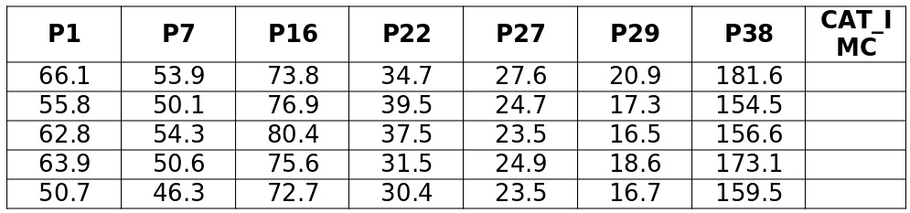

---
header-evals:
- \usepackage{longtable}
- \usepackage[utf8]{inputenc}
- \usepackage[spanish]{babel}\decimalpoint
#- \setlength{\parindent}{1.25cm}
- \usepackage{amsmath}
output:
  pdf_document:
    number_sections: true
fontsize: 12pt
papersize: letter
#geometry: margin = 1in
language: "es"
lang: es-ES
---

```{r setup, echo=FALSE}
knitr::opts_chunk$set(warning = FALSE,
                      message = FALSE, echo = FALSE,fig.align = "center",
                      fig.height = 3.2, fig.pos = "H")

```

```{r}
library(splitstackshape)
library(tidyverse)
library(knitr)
library(kableExtra)
library(data.table)
library(ggplot2)
library(gridExtra)
library(Amelia)
```

```{=tex}
\pagestyle{myheadings}
\input{DocumentFormat/titlepage}
\thispagestyle{empty}
\tableofcontents
\listoffigures
\listoftables
\newpage
```
\setcounter{page}{2}

```{=tex}
\begin{center}
\textbf{Trabajo 1}
\end{center}
```
**Selección de la muestra de datos**

Se incluye el código propuesto por el docente, con la intención de validar la extracción de la muestra

```{r, echo=TRUE}
library(splitstackshape) 
uno <- read.table("Data/data.txt", header=T, sep=",")

genera <- function(cedula){
set.seed(cedula)
aux <- stratified(uno, "CAT_IMC", 200/2100, bothSets=T)
mue <- aux$SAMP1
mue
}

data <- genera(1020479466)
```

\section{Para todas sus variables realice un análisis exploratorio gráfico e identifique posibles valores atípicos u otro tipo de anomalías. (Para las variables Categóricas diagramas de barras, para las continuas o discretas, use Histogramas y/o Boxplot). Comente brevemente.}

\subsection{Análisis Descriptivos}

Breve descripción de la base de datos: La base de datos corresponde a las medidas antropométricas de la población laboral colombiana (ACOPLA). Esta base de datos cuenta con 200 observaciones y 9 variables de interés, las cuales son:

\-**Sexo:** Variable categórica (Hom, Muj)

\-**P1: Masa Corporal** Variable continua (kg)

\-**P7: Perímetro muslo mayor** Variable continua (cm)

\-**P16: Perímetro abdominal cintura** Variable continua (cm)

\-**P22: Anchura de las caderas** Variable continua (cm)

\-**P27: Longitud promedio de los pies** Variable continua (cm)

\-**P29: Longitud promedio de las manos** Variable continua (cm)

\-**P38: Estatura** Variable continua (cm)

\-**CAT_IMC: Categoría del indice de masa corporal** Variable categórica (DELGADO, NORMAL Y OBESO)

\subsection{Resumen Numerico}

```{r}
# Cargar paquetes necesarios
library(knitr)
library(kableExtra)
library(data.table)

# Convertir 'aux' a formato de data.table
aux <- data[, 2:8]
aux <- as.data.table(aux)

# Crear un vector con los nombres de las columnas
nombre <- colnames(aux)

# Crear listas vacías para almacenar los resúmenes estadísticos
media <- numeric()
mediana <- numeric()
desviacion_estandar <- numeric()
cuartil_1 <- numeric()
cuartil_2 <- numeric()
cuartil_3 <- numeric()
rango <- numeric()
rango_imc <- numeric()

# Calcular los resúmenes estadísticos y almacenarlos en las listas
for (i in 1:7) {
  media <- c(media, mean(aux[[i]], na.rm = TRUE))
  mediana <- c(mediana, median(aux[[i]], na.rm = TRUE))
  desviacion_estandar <- c(desviacion_estandar, sd(aux[[i]], na.rm = TRUE))
  cuartil_1 <- c(cuartil_1, quantile(aux[[i]], na.rm = TRUE)[2])
  cuartil_2 <- c(cuartil_2, quantile(aux[[i]], na.rm = TRUE)[3])
  cuartil_3 <- c(cuartil_3, quantile(aux[[i]], na.rm = TRUE)[4])
  rango <- c(rango, max(aux[[i]], na.rm = TRUE) - min(aux[[i]], na.rm = TRUE))
  rango_imc <- c(rango_imc, IQR(aux[[i]], na.rm = TRUE))
}

# Crear un data frame con los resúmenes estadísticos
especial <- data.frame(
  "Variable" = nombre,
  "Media" = media,
  "Mediana" = mediana,
  "SD" = desviacion_estandar,
  "Q1" = cuartil_1,
  "Q2" = cuartil_2,
  "Q3" = cuartil_3,
  "Rango intercuartil" = rango_imc,
  "Rango" = rango
)

# Imprimir la tabla en formato LaTeX usando kable
kable(especial, caption = "Tabla de resúmenes estadísticos de variables continuas",
      format = "latex", booktabs = TRUE) %>%
  kable_styling(latex_options = c("HOLD_position"), position = "center", full_width = FALSE)

```

```{r, eval=FALSE}
p1 <- ggplot(aux, aes(x = aux$P1))+
  geom_histogram() +
    labs(title = "Histograma de la Masa Corporal")+
    ylab("conteo")+
    xlab("P1")


p2 <- ggplot(aux, aes(x = aux$P7))+
  geom_histogram() +
    labs(title = "Histograma del Perímetro muslo mayor")+
    ylab("conteo")+
    xlab("P7")

p3 <- ggplot(aux, aes(x = aux$P16))+
  geom_histogram() +
    labs(title = "Histograma del Perímetro abdominal cintura")+
    ylab("conteo")+
    xlab("P16")


p4 <- ggplot(aux, aes(x = aux$P22))+
  geom_histogram() +
    labs(title = "Histograma de la Anchura de las caderas")+
    ylab("conteo")+
    xlab("P22")

p5 <- ggplot(aux, aes(x = aux$P27))+
  geom_histogram() +
    labs(title = "Histograma de la Longitud promedio de los pies")+
    ylab("conteo")+
    xlab("P27")

p6 <- ggplot(aux, aes(x = aux$P29))+
  geom_histogram() +
    labs(title = "Histograma de la Longitud promedio de las manos")+
    ylab("conteo")+
    xlab("P29")

p7 <- ggplot(aux, aes(x = aux$P38))+
  geom_histogram() +
    labs(title = "Histograma de la Estatura")+
    ylab("conteo")+
    xlab("P38")

library(cowplot)
plot_grid(p1, p2, p3, p4,
          ncol = 2, align = "hv", labels = "AUTO")


plot_grid(p5, p6, p7,
          ncol = 2, align = "hv", labels = "AUTO")
```

\subsection{Histogramas}

```{r}
par(mfrow=c(2,3), new=T)
hist(aux$P1, col='black', main='Histograma Masas', xlab="MASA")
hist(aux$P7, col='black', main='Histograma Perim_Muslo', xlab="PERIMETRO MUSLO")
hist(aux$P16, col='black', main='Histograma Long-Abdominal', xlab="PERIM ABDOMINAL CINTURA")
hist(aux$P22, col='black', main='Histograma Anchura-Caderas', xlab="ANCHURA DE LAS CADERAS")
hist(aux$P27, col='black', main='Histograma Long-Pie', xlab="L_PIE")
hist(aux$P29, col='black', main='Histograma Long-Mano', xlab="L_MAN")
```

```{r}
hist(aux$P38, col='black', main='Histograma Estatura', xlab="ESTATURA")
```

\subsection{Boxplots}

```{r}
par(mfrow=c(2,3), new=T)
boxplot(aux$P1, col='gray', main='Boxplot Masas', xlab="MASA")
boxplot(aux$P7, col='gray', main='Boxplot Perim_Muslo', xlab="PERIMETRO MUSLO")
boxplot(aux$P16, col='gray', main='Boxplot Long-Abdominal', xlab="PERIM ABDOMINAL CINTURA")
boxplot(aux$P22, col='gray', main='Boxplot Anchura-Caderas', xlab="ANCHURA DE LAS CADERAS")
boxplot(aux$P27, col='gray', main='Boxplot Long-Pie', xlab="L_PIE")
boxplot(aux$P29, col='gray', main='Boxplot Long-Mano', xlab="L_MAN")
```

```{r}
boxplot(aux$P38, col='gray', main='Boxplot Estatura', xlab="ESTATURA")
```

\subsection{Diagrama de Barras}

```{r}
resum <- data %>% group_by(Sexo) %>% count()
resum$porcentaje = resum$n/sum(resum$n) * 100

ggplot(resum, aes(x = Sexo, y = porcentaje, fill = Sexo)) +
  geom_bar(stat = "identity") +
  geom_text(aes(label = paste0(round(porcentaje, 1), "%")), 
            position = position_stack(vjust = 0.5), size = 4) +
  labs(
    x = "Sexo",
    y = "Porcentaje"
  ) +
  theme_minimal()
```

```{r}
resum <- data %>% group_by(CAT_IMC) %>% count()
resum$porcentaje = resum$n/sum(resum$n) * 100

ggplot(resum, aes(x = CAT_IMC, y = porcentaje, fill = CAT_IMC)) +
  geom_bar(stat = "identity") +
  geom_text(aes(label = paste0(round(porcentaje, 1), "%")), 
            position = position_stack(vjust = 0.5), size = 4) +
  labs(
    x = "Categoria de Indice de Masa Corporal",
    y = "Porcentaje"
  ) +
  theme_minimal()
```

\section{Realice el respectivo proceso de imputación para los datos faltantes en su base de datos. Explique cómo realiza dicha imputación, cuál criterio utiliza y muestre un par de ejemplos ilustrativos.}

\subsection{Imputación de datos faltantes}

```{r}
missmap(data, main = "Visualización de Datos Faltantes", col = c("red", "blue"))
```

\section{Considere las variables P1, P29 y P38. ¿Se puede afirmar que cada variable por separado permitiría discriminar entre Hombres y Mujeres? Elabore los resúmenes numéricos y gráficos que considere pertinentes para responder la pregunta.}


\section{Usando las variables continuas, realice un gráfico de dispersión para identificar posibles relaciones entre sus variables. Explique si lo que se observa gráficamente tiene sentido o es coherente a la luz de sus datos. Corrobore lo observado con el cálculo de la matriz de correlaciones. Comente. Repita el proceso discriminando por SEXO. ¿Hay cambios en las estructuras de Covarianzas para ambos grupos? Comente}

\subsection{Relaciones entre variables}

```{r}
library(PerformanceAnalytics)
chart.Correlation(aux, histogram = TRUE, method = "pearson",pch="+")
```


\section{Elabore una tabla de porcentajes de doble entrada con las variables CATIMC y SEXO. Luego presente la información gráficamente. ¿Se puede afirmar que la distribución porcentual de la variable CATIMC es diferente para hombre y mujeres? Justifique su respuesta.}

\subsection{Distribución porcentual y tabla de contingencia.}

```{r}
datosf_5<-table(data$CAT_IMC,data$Sexo)
sinsum<- round(prop.table(datosf_5),2)
tablaprop <- addmargins(round(prop.table(datosf_5),3))*100
kable(tablaprop, caption="Tabla de contingencia porcentual de doble entrada.",
format = "latex",booktabs=TRUE) %>%
kable_styling(latex_options = c("HOLD_position"),
position = "center",full_width = FALSE)
```


```{r}
data %>%
ggplot(aes(x = Sexo, fill = CAT_IMC)) +
geom_bar(position = "fill") +
scale_y_continuous(labels = scales::percent) +
labs(x = "Sexo", fill = "Categoricas IMC")
```


\section{Se tienen los siguientes datos de 5 personas, de las cuales se desconoce su CATIMC.Usando la distancia estadística, determine a cuál de las tres categorías pertenece cada sujeto. Explique claramente el proceso empleado para clasificar los sujetos. Anexe el código empleado.}




\subsection{Clasificación usando la distancia estadística}
