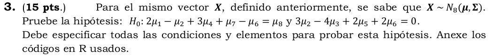

---
header-evals:
- \usepackage{longtable}
- \usepackage[utf8]{inputenc}
- \usepackage[spanish]{babel}\decimalpoint
#- \setlength{\parindent}{1.25cm}
- \usepackage{amsmath}
output:
  pdf_document:
    number_sections: true
fontsize: 12pt
papersize: letter
#geometry: margin = 1in
language: "es"
lang: es-ES
---

```{r setup, echo=FALSE}
knitr::opts_chunk$set(warning = FALSE,
                      message = FALSE, echo = TRUE,fig.align = "center",
                      fig.height = 3.2, fig.pos = "H")

```

```{r, echo = FALSE}
library(tidyverse)
library(knitr)
library(mvnormtest)
library(factoextra)
```

```{=tex}
\pagestyle{myheadings}
\input{DocumentFormat/titlepage}
```
\setcounter{page}{2}


\section{Parte A}

\section{Parte B}

Para todos los efectos el vector $X = (P_1, P_7, P_{16}, P_{22}, P_{25}, P_{27}, P_{29}, P_{38})$ contiene las variables continuas de su base de datos. Por notación sea el respectivo $\mu = (\mu_1, \mu_2, \mu_3, \mu_4, \mu_5, \mu_6, \mu_7, \mu_8)$ vector de medias y $\Sigma$ su matriz de covarianzas.

Se procede a tomar la muestra aleatoria con la cedula **1020479466** y a seleccionar las variables numéricas.

```{r, echo = TRUE}
library(splitstackshape)
uno <- read.table("Data/base.txt", header = TRUE)
genera <- function(cedula){
set.seed(cedula)
aux <- stratified(uno, "CAT_IMC", 200/2100)
aux
} 

datos <- genera(1020479466)
x <- datos %>% select(P1, P7, P16, P22, P25, P27, P29, P38)
```

<!---Punto 1 --->


Primero procederemos a verificar si el vector de variables se distribuye normal por medio de la prueba estadística Shapiro-Wilk de normalidad multivariada.

```{r}

library(mvnormtest)
mu_0 <- c(66.1, 58, 81.6, 37, 47, 25, 19.2, 167)
mshapiro.test(t(as.matrix(x)))
```

Observando un $Valor P = 4.09\times10^{-8}$, podemos rechazar la hipótesis nula con un nivel de significancia de $\alpha = 0.05$ lo que nos permite concluir que $X$ no cumple normalidad multivariada. Basado en el **Teorema del limite central** sabemos que si se tiene:

$\overline{\mathbf{X}}_n=\frac{1}{n} \sum_{i=1}^n \mathbf{X}_i$ y $\mathbf{Z}_n=\sqrt{n}\left(\overline{\mathbf{X}}_n-\boldsymbol{\mu}\right)$

Luego:

$$
\mathbf{Z}_n \stackrel{d}{\rightarrow} N_p(\mathbf{0}, \boldsymbol{\Sigma}) .
$$

con $\Sigma > 0$: $$
\tilde{\mathbf{Z}}_n=\boldsymbol{\Sigma}^{-\frac{1}{2}} \sqrt{n}\left(\overline{\mathbf{X}}_n-\boldsymbol{\mu}\right) \stackrel{d}{\rightarrow} N_p\left(\mathbf{0}, I_p\right)
$$

y

$$
n\left(\overline{\mathbf{X}}_n-\boldsymbol{\mu}\right)^{\prime} S^{-1}\left(\overline{\mathbf{X}}_n-\boldsymbol{\mu}\right) \stackrel{d}{\rightarrow} \chi^2(p)
$$ Bajo $H_0$ cierta. El estadístico de prueba es:

$$
\chi_0^2=n\left(\bar{X}-\mu_0\right)^{\prime} S^{-1}\left(\bar{X}-\mu_0\right)
$$

Se define las siguientes pruebas de hipótesis:

$$H_0: \mu = \mu_0\ vs\  H_a: \mu \ne \mu_0$$ Se procede a hallar el vector de medias muestral $\bar{X}$ y la matriz de covarianzas muestral S en R.

```{r, echo = T}
xbar <- colMeans(x)
s <- cov(x)
n <- nrow(x)
p <- length(x)
mu_0<- as.matrix(c(mu_0))
chi_0 <- as.numeric(n*(t(xbar-mu_0)) %*%solve(s) %*%(xbar-mu_0))
chi_0
```

Se plantea una región de rechazo de $H_0$ dada por: $$ X_0^{2} > X_\alpha^{2}(p)$$

```{r}
qchisq(0.05, p, lower.tail = F)
```

Dado que la prueba nos arroja $X_0^{2} = 1603.695 > X_{0.05}^{2}(8) = 15.50731$ con un nivel de significancia de $\alpha = 0.05$. Se rechaza $H_0$, lo que nos permite concluir que existen diferencia entre el vector $\mu$ y $\mu_0$.

<!---Punto 2 --->


\subsection{Análisis discriminado sexo Masculino:}

Se procede a filtra los datos por el genero masculino.

```{r}
hom <- datos %>% filter(SEXO == "Hom") %>% select(P1, P7, P16, P22, P25, P27, P29, P38)
```

Se plantea sus hipótesis de normalidad multivariada discriminando por el genero de hombres.

$$
H_o: X_H \sim N_p(\mu, \Sigma)\ VS\ H_a: X_H \nsim N_p(\mu, \Sigma)
$$

```{r}
mshapiro.test(t(as.matrix(hom)))
```

Observando un $Valor P = 1.91\times10^{-6}$, podemos rechazar la hipótesis nula con un nivel de significancia de $\alpha = 0.05$ lo que nos permite concluir que el vector de variables $X$ para los hombres no se distribuye normal, por tanto basado en el teorema del limite central tenemos que el estadístico de prueba es:

$$
\chi_0^2=n\left(\bar{X}_{h o m}-\mu_0\right)^{\prime} S_{h o m}^{-1}\left(\bar{X}_{h o m}-\mu_0\right) \stackrel{d}{\longrightarrow} \chi_\alpha^2(\boldsymbol{P})
$$ Con sus respectivas hipotesis:

$$H_0: \mu_{homb} = \mu_0 \ vs \ H_a: \mu_{homb} \ne \mu_o$$

```{r}
xbar <- colMeans(hom)
s <- cov(hom)
n <- nrow(hom)
p <- length(hom)
mu_0<- as.matrix(c(mu_0))
chi_0 <- as.numeric(n*(t(xbar-mu_0)) %*%solve(s) %*%(xbar-mu_0))
chi_0
```

Se plantea una región de rechazo de $H_0$ dada por: $$ X_0^{2} > X_\alpha^{2}(p)$$

```{r}
qchisq(0.05, p, lower.tail = F)
```

Dado que la prueba nos arroja $X_0^{2} = 1403.088 > X_{0.05}^{2}(8) = 15.50731$ con un nivel de significancia de $\alpha = 0.05$. Se rechaza $H_0$, lo que nos permite concluir que existen diferencia entre el vector $\mu_{homb}$ y $\mu_0$.

\subsection{Análisis discriminado sexo Femenino:}

Se procede a filtra los datos por el genero masculino.

```{r}
muj <- datos %>% filter(SEXO == "Muj") %>% select(P1, P7, P16, P22, P25, P27, P29, P38)
```

Se plantea sus hipótesis de normalidad multivariada discriminando por el genero de mujeres.

$$
H_o: X_M \sim N_p(\mu, \Sigma)\ VS\ H_a: X_M \nsim N_p(\mu, \Sigma)
$$

```{r}
mshapiro.test(t(as.matrix(muj)))
```

Observando un $Valor P = 0.001285$, podemos rechazar la hipótesis nula con un nivel de significancia de $\alpha = 0.05$ lo que nos permite concluir que el vector de variables $X$ para las mujeres no se distribuye normal, por tanto basado en el teorema del limite central tenemos que el estadístico de prueba es:

$$
\chi_0^2=n\left(\bar{X}_{muj}-\mu_0\right)^{\prime} S_{muj}^{-1}\left(\bar{X}_{h o m}-\mu_0\right) \stackrel{d}{\longrightarrow} \chi_\alpha^2(\boldsymbol{P})
$$ Con sus respectivas hipotesis:

$$H_0: \mu_{muj} = \mu_0 \ vs \ H_a: \mu_{muj} \ne \mu_o$$

```{r}
xbar <- colMeans(muj)
s <- cov(muj)
n <- nrow(muj)
p <- length(muj)
mu_0<- as.matrix(c(mu_0))
chi_0 <- as.numeric(n*(t(xbar-mu_0))%*%solve(s)%*%(xbar-mu_0))
chi_0
```

Se plantea una región de rechazo de $H_0$ dada por: $$ X_0^{2} > X_\alpha^{2}(p)$$

```{r}
qchisq(0.05, p, lower.tail = F)
```

Dado que la prueba nos arroja $X_0^{2} = 2773.412 > X_{0.05}^{2}(8) = 15.50731$ con un nivel de significancia de $\alpha = 0.05$. Se rechaza $H_0$, lo que nos permite concluir que existen diferencia entre el vector $\mu_{muj}$ y $\mu_0$.

<!--- Punto3 --->



Primero se procede a plantear las hipótesis para los contrastes, como:

$$
H_0: C \mu=\gamma \quad V S \quad C \mu \neq \gamma
$$

Escritas de otra manera como:

$$
H_0: 2 \mu_1-\mu_2+3 \mu_4+\mu_7-\mu_6=\mu_8 \quad y \quad 3 \mu_2-4 \mu_3+2 \mu_5+2 \mu_6=0
$$

Donde:

$$
C=\left(\begin{array}{ccccccccc}
2 & -1 & 0 & 3 & 0 & -1 & 1 & -1\\
0 & 3 & -4 & 0 & 2 & 2 & 0 & 0 
\end{array}\right)
$$

Estadístico de prueba:

$$
T_0^2=n(C \overline{\mathbf{X}}-\gamma)^{\prime}\left(C S C^{\prime}\right)^{-1}(C \overline{\mathbf{X}}-\gamma)
$$ Bajo $H_0$ cierto. Se rechaza si $\frac{n-k}{(n-1) k} T_0^2>f_\alpha(k, n-k)$

```{r, include = F, eval = F}
mu <- colMeans(x)
s <- cov(x)
n <- nrow(x)
c <- matrix(c(2,-1,0,3,0,-1,1,-1,0,3,-4,0,2,2,0,0), byrow = T, ncol=8,nrow=2)
r <- cbind(c(0,0))
T_0 <- n*t((c%*%mu-r))%*%solve(c%*%s%*%t(c))%*%(c%*%mu-r)
fcal <- (n-2)/(2*(n-1))*as.numeric(T_0)
f_alpha <- qf(0.05,2,199-2,lower.tail = F)
```

Luego tenemos un $\frac{199-2}{2(199-1)}T_0^2 = 50.57493 > f_{0.05}(2, 197) = 3.041753$ y con una significancia de $\alpha = 0.05$ lo que nos permite rechazar $H_0$ concluyendo que $2 \mu_1-\mu_2+3 \mu_4+\mu_7-\mu_6\neq\mu_8 \quad y \quad 3 \mu_2-4 \mu_3+2 \mu_5+2 \mu_6\neq0$

<!---Punto 4 --->


Se plantean las respectivas Hipótesis como: 
$$H_o:\Sigma_{obeso} = \Sigma_{normal} = \Sigma_{delgado} \ vs \ H_a:\Sigma_{obeso} \neq \Sigma_{normal} \neq \Sigma_{delgado} $$


```{r}
delg <- datos %>% filter(CAT_IMC == 'Delgado')
norm <- datos %>% filter(CAT_IMC == 'Normal')
obes <- datos %>% filter(CAT_IMC == 'Obeso')

delg <- delg[, 2:9]
norm <- norm[, 2:9]
obes <- obes[, 2:9]

n1 <- nrow(delg)
n2 <- nrow(norm)
n3 <- nrow(obes)
p <- ncol(delg)
g <- 3

# Varianzas muestrales 
s1 <- matrix(var(delg), ncol=8)
s2 <- matrix(var(norm), ncol=8)
s3 <- matrix(var(obes), ncol=8)

# Matriz ponderada
sum_ni <- ((n1-1)+(n2-1)+(n3-1))
sum_inv_ni <- (1/(n1-1))+(1/(n2-1))+(1/(n3-1))
k <- (2*p^2 +3*p-1)/(6*(p+1)*(g+1))

sp <- ((n1-1)*s1+(n2-1)*s2+(n3-1)*s3)/sum_ni

# Estadístico M 
M <- sum_ni*log(det(sp))-((n1-1)*log(det(s1))+(n2-1)*log(det(s2))+(n3-1)*log(det(s3)))
u <- (sum_inv_ni -(1/sum_ni))*k
C <- (1-u)*M

#Chi^2
alpha <- 0.05
gl <- p*(p+1)*(g-1)/2
q <- qchisq(alpha,gl)
```


Se obtine un $C = 121.4472 > \chi_{0.05}^{2} = 53.46233$ con una significancia de $\alpha = 0.05$ nos permite rechazar $H_0$ y concluir que la estructura de covarianza es diferente para los tres grupos $\Sigma_{obeso} \neq \Sigma_{normal} \neq \Sigma_{delgado}$. 


<!---Punto 5 --->

 


<!---Punto 6 --->


```{r}
var_m <- cov(x) %>% as.matrix()
eigen_vec <- eigen(var_m)
```


```{=tex}
\begin{center}
\textbf{Vectores Propios}
\end{center}
```

 
```{r}
eigen_vec$vectors
```
```{=tex}
\begin{center}
\textbf{Valores Propios}
\end{center}
```


```{r}
eigen_values <- eigen_vec$values
eigen_values
```

```{=tex}
\begin{center}
\textbf{Componentes Principales}
\end{center}
```


```{r}
pca <- prcomp(var_m)
summary(pca)
```

```{r}
fviz_eig(pca, addlabels = TRUE, ylim = c(0, 93), main="Figure 1")
```

